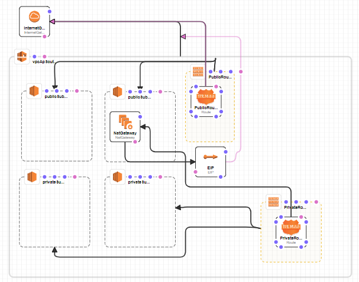

# 1. 3-tier-architecture

Link: [Designing a three tier architecture](https://medium.com/the-andela-way/designing-a-three-tier-architecture-in-aws-e5c24671f124#:~:text=Introduction&text=A)

# 2. Navigating through CloudFormation

##  2.1 Navigating the UI

1. Services -> CloudFormation
   
2. We will try building a template from scratch. Create template in Designer
   
3. Rename the file
   

## 2.2 Testing CF scripts

1. First configure your `AWS Access Key ID`, `AWS Secret Access Key` and `Default region name` on the CLI

   ```shell
   aws configure
   ```

2. Then run the following command. Link: [Validating CF templates](https://docs.aws.amazon.com/AWSCloudFormation/latest/UserGuide/using-cfn-validate-template.html)

   ```shell
   aws cloudformation validate-template --template-body file://three_tier_stack.yaml
   ```

   

# 3. Objective 1: Deploying a VPC, 2AZs and their subnets

## 3.1 Add the VPC

1. On the left panel "Resource Types", grab the VPC and drag it in
   

2. Rename the VPC to something more logical. Naming rules are [a-zA-Z0-9]
   

3. Then we need to add the `CidrBlock` property to it (Compulsory) this has to be done in the `Template` section. We can also add a `Tag` for the VPC. Link: [VPC CloudFormation](https://docs.aws.amazon.com/AWSCloudFormation/latest/UserGuide/aws-resource-ec2-vpc.html)

   ```yaml
   Resources:
     vpcApSoutheast1ThreeTierStack:
    Type: 'AWS::EC2::VPC'
       Properties: 
         CidrBlock: 10.0.0.0/16
         Tags:
          - Key: Name
            Value: vpc-ap-southeast-1-d-three-tier-Stack
   ```
   
   

## 3.2 Add the AZs and Subnets

Note: There is no AZ component, we just have to configure the subnet CIDR and properties

Since we are deploying in ap-southeast-1, there are 3 Availability Zones to choose from 

1. ap-southeast-1a (apse1-az2). This will contain 
   - public-subnet-1. CIDR (10.0.1.0/24)
   - private-subnet-3. CIDR (10.0.3.0/24)
2. ap-southeast-1b (apse1-az1). This will contain 
   - public-subnet-2. CIDR (10.0.2.0/24)
   - private-subnet-4. CIDR (10.0.4.0/24)
3. ap-southeast-1c (apse1-az3). We don't need this AZ

<u>**In Cloud Designer**</u>

1. From the Resource types -> EC2 -> Subnet. Add 4 subnets and rename them accordingly
   

2. Assign subnets to AZs. Link: [subnet AZ Cloudformation](https://docs.aws.amazon.com/AWSCloudFormation/latest/UserGuide/intrinsic-function-reference-getavailabilityzones.html) and [Nested Functions with Short Form YAML](https://docs.aws.amazon.com/AWSCloudFormation/latest/UserGuide/intrinsic-function-reference-select.html)

   ```yaml
   publicSubnet1:
       Type: 'AWS::EC2::Subnet'
       Properties:
         VpcId: !Ref vpcApSoutheast1ThreeTierStack
         AvailabilityZone: !Select
           - 0
           - Fn::GetAZs: !Ref 'AWS::Region'
       Metadata:
         'AWS::CloudFormation::Designer':
           id: e30d239b-b3ea-4ffb-8d01-2c09354147cf
   ```
   
3. Add the IPs for the subnets and their tags. Link: [subnet properties Cloudformation](https://docs.aws.amazon.com/AWSCloudFormation/latest/UserGuide/aws-resource-ec2-subnet.html#cfn-ec2-subnet-availabilityzone)

   ```yaml
   publicSubnet1:
       Type: 'AWS::EC2::Subnet'
       Properties:
         VpcId: !Ref vpcApSoutheast1ThreeTierStack
         CidrBlock: 10.0.1.0/24
         AvailabilityZone: !Select
           - 0
           - Fn::GetAZs: !Ref 'AWS::Region'
         Tags:
           - Key: Name
             Value: public-subnet-1
       Metadata:
         'AWS::CloudFormation::Designer':
           id: e30d239b-b3ea-4ffb-8d01-2c09354147cf
   ```
   
   

# 4. Objective 2: Create an Internet Gateway and Route tables

## 4.1 Creating the Internet Gateway

Useful Link:[Cloud Formation Designer Walkthrough](https://docs.aws.amazon.com/AWSCloudFormation/latest/UserGuide/working-with-templates-cfn-designer-walkthrough-createbasicwebserver.html)

1. In Cloud Designer: EC2 -> InternetGateway -> Place it outside the VPC -> Rename it `InternetGateway` the Tag will be the same
   

2. Create a connection between the `InternetGateway` resource (`AWS::EC2::VPCGatewayAttachment`) and the `VPC` resource (anywhere on the border).
   

3. Add a `Tag` to the `InternetGateway`, Link: [Internet Gateway Properties](https://docs.aws.amazon.com/AWSCloudFormation/latest/UserGuide/aws-resource-ec2-internetgateway.html)

   ```yaml
     InternetGateway:
       Type: 'AWS::EC2::InternetGateway'
       Properties:
         Tags:
           - Key: Name
             Value: InternetGatewayThreeTierStack
       Metadata:
         'AWS::CloudFormation::Designer':
           id: 2033d870-81b5-452d-8f46-d2be6c231f58
     InternetGatewayAttachment:
       Type: 'AWS::EC2::VPCGatewayAttachment'
       Properties:
         VpcId: !Ref vpcApSoutheast1ThreeTierStack
         InternetGatewayId: !Ref InternetGateway
       Metadata:
         'AWS::CloudFormation::Designer':
           id: 53e220ef-0dc3-40f2-a392-a18a91ae642b
   ```

## 4.2 Creating the Route Tables

Route tables 

- Are added inside the VPC (Associates them to the VPC). 
- They are responsible for specifying how to direct network traffic from within a subnet.

### 4.2.1 First Route Table: Public Route Table

There are some nuances when creating a public route. This [video](https://www.youtube.com/watch?v=jLP_gw5PRzc) was useful

1. Drag and drop a Route Table and rename it `PublicRouteTable`
   

2. Add a Route to the Route Table and rename it `PublicRoute`
   

3. Add a connection between the Internet Gateway (`AWS::EC2::VPCGatewayAttachment`) and the `PublicRoute` (`AWS::EC2::VPNGateway/AWS::EC2::InternetGateway (Property: GatewayId`). When doing this, drag from the `publicRoute` to the Internet Gateway (It will be highlighted in green)
   
   

4. The documentation states that "AWS CloudFormation can't associate a route with an Internet gateway until you associate the Internet gateway with the VPC. This means we need to create an explicit dependency on the Internet gateway-VPC attachment". 

5. From the documentation: On the `PublicRoute` resource, hover over the **DependsOn** dot.Drag a connection to the Internet gateway-VPC attachment (`AWS::EC2::VPCGatewayAttachment`). With `DependsOn` connections, AWS CloudFormation Designer creates a dependency (a `DependsOn` attribute), where the originating resource depends on the target resource. In this case, AWS CloudFormation Designer adds a `DependsOn` attribute to the `PublicRoute` resource and specifies the gateway-VPC attachment as a dependency.
   
   
   

6. Associate the public subnets with the route table
   
   

7. Rename the associations and assign Tags to the Route Table. We also need a `DestinationCidrBlock` which is to the internet. Link: [Route Table Properties](https://docs.aws.amazon.com/AWSCloudFormation/latest/UserGuide/aws-resource-ec2-route-table.html)

   ```yaml
     PublicRoute:
       Type: 'AWS::EC2::Route'
       Properties:
         RouteTableId: !Ref PublicRouteTable
         GatewayId: !Ref InternetGateway
         DestinationCidrBlock: 0.0.0.0/0
       Metadata:
         'AWS::CloudFormation::Designer':
           id: e84213df-6d14-485f-af68-a9fbd2d748b3
       DependsOn:
         - InternetGateway
     PublicRouteSubnet2Association:
       Type: 'AWS::EC2::SubnetRouteTableAssociation'
       Properties:
         RouteTableId: !Ref PublicRouteTable
         SubnetId: !Ref publicSubnet2
       Metadata:
         'AWS::CloudFormation::Designer':
           id: f898f40d-8d46-49b1-ad7b-7771facbfbf9
     PublicRouteSubnet1Association:
       Type: 'AWS::EC2::SubnetRouteTableAssociation'
       Properties:
         RouteTableId: !Ref PublicRouteTable
         SubnetId: !Ref publicSubnet1
       Metadata:
         'AWS::CloudFormation::Designer':
           id: 1aee7cd1-82e1-417d-ba40-ba5bee6b8849
     PrivateRouteTable:
       Type: 'AWS::EC2::RouteTable'
       Properties:
         VpcId: !Ref vpcApSoutheast1ThreeTierStack
         Tags:
           - Key: Name
             Value: private-route-table
       Metadata:
         'AWS::CloudFormation::Designer':
           id: ac81569b-4f99-441d-8ca5-db0743426eff
   ```


### 4.2.2 Second Route Table: Private Route Table

1. Drag and drop the route table and rename it
   

2. Add a Route to the Private Route Table and rename it
   

3. Connect the Route Table to the Private subnets and rename the associations
   

4. Give a `Tag` to the Route Table. Add a `DestinationCidrBlock` to the internet on the Route. Later when the Nat Gateway is created, use `NatGatewayId` to connect them. For now, comment out the routes and associations to avoid errors. We will just create the private table first without any routes or associations

   ```yaml
     PrivateRouteTable:
       Type: 'AWS::EC2::RouteTable'
       Properties:
         VpcId: !Ref vpcApSoutheast1ThreeTierStack
         Tags:
           - Key: Name
             Value: private-route-table
       Metadata:
         'AWS::CloudFormation::Designer':
           id: ac81569b-4f99-441d-8ca5-db0743426eff
     # PrivateRoute:
     #   Type: 'AWS::EC2::Route'
     #   Properties:
     #     RouteTableId: !Ref PrivateRouteTable
     #     DestinationCidrBlock: 0.0.0.0/0
     #   Metadata:
     #     'AWS::CloudFormation::Designer':
     #       id: 851eeb98-3bce-4fa2-a9c7-21a11ee6611d
     # PrivateRouteSubnet4Association:
     #   Type: 'AWS::EC2::SubnetRouteTableAssociation'
     #   Properties:
     #     RouteTableId: !Ref PrivateRouteTable
     #     SubnetId: !Ref privateSubnet4
     #   Metadata:
     #     'AWS::CloudFormation::Designer':
     #       id: 378d451e-1d23-490b-9c45-37a236f327be
     # PrivateRouteSubnet3Association:
     #   Type: 'AWS::EC2::SubnetRouteTableAssociation'
     #   Properties:
     #     RouteTableId: !Ref PrivateRouteTable
     #     SubnetId: !Ref privateSubnet3
     #   Metadata:
     #     'AWS::CloudFormation::Designer':
     #       id: 39e92247-612f-4e18-99e3-59ab3b87d421
   ```

   

# 5. Objective 3: Create the NAT Gateway and update the Routes

Link to CloudFormation Nat Gateway set-up

- [AWS::EC2::NatGateway](https://docs.aws.amazon.com/AWSCloudFormation/latest/UserGuide/aws-resource-ec2-natgateway.html)
- [Taking NAT to the Next Level in AWS CloudFormation Templates](https://aws.amazon.com/blogs/apn/taking-nat-to-the-next-level-in-aws-cloudformation-templates/)
- [vpc-nat-gateway.yaml](https://github.com/widdix/aws-cf-templates/blob/master/vpc/vpc-nat-gateway.yaml)

Creating the CF

1. Drag and drop the Nat Gateway into the public subnet and the EIP into the VPC
   

2. Link the route to the NatGateway
   

3. This changes the YAML for the private route to have `NatGatewayId`

   ```yaml
     PrivateRoute:
       Type: 'AWS::EC2::Route'
       Properties:
         RouteTableId: !Ref PrivateRouteTable
         DestinationCidrBlock: 0.0.0.0/0
         NatGatewayId: !Ref NatGateway
       Metadata:
         'AWS::CloudFormation::Designer':
           id: 851eeb98-3bce-4fa2-a9c7-21a11ee6611d
   ```

4. Link the Elastic IP to depend on the Internet Gateway Attachment
   

5. According to the documentation, the Properties should be `Domain: vpc`, which according to [AWS::EC2::EIP](https://docs.aws.amazon.com/AWSCloudFormation/latest/UserGuide/aws-properties-ec2-eip.html) means allocating the address for use with instances in a VPC. In this case we want to allocate to the NatGateway

   ```yaml
     EIP:
       Type: 'AWS::EC2::EIP'
       Properties:
         Domain: vpc
       Metadata:
         'AWS::CloudFormation::Designer':
           id: dc0c0377-5868-4684-856b-9ad8501a3439
   ```

6. The documentation suggests adding an `allocationID`of the elastic IP address to associate with the NAT gateway. I couldn't seem to connect any arrows in Cloud Designer. Hence I edited the YAML manually.

   ```yaml
     NatGateway:
       Type: 'AWS::EC2::NatGateway'
       Properties:
         AllocationId:
           Fn::GetAtt:
             - EIP
             - AllocationId
         SubnetId: !Ref publicSubnet2
         Tags:
           - Key: Name
             Value: nat-three-tier-stack
   ```

7. Upon typing these, the diagram in Cloud Designer Changes

   