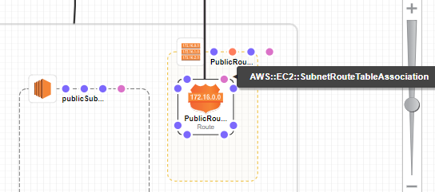

# 1. 3-tier-architecture

Link: [Designing a three tier architecture](https://medium.com/the-andela-way/designing-a-three-tier-architecture-in-aws-e5c24671f124#:~:text=Introduction&text=A)

# 2. Navigating through CloudFormation

##  2.1 Navigating the UI

1. Services -> CloudFormation
   
2. We will try building a template from scratch. Create template in Designer
   
3. Rename the file
   

## 2.2 Testing CF scripts

1. First configure your `AWS Access Key ID`, `AWS Secret Access Key` and `Default region name` on the CLI

   ```shell
   aws configure
   ```

2. Then run the following command. Link: [Validating CF templates](https://docs.aws.amazon.com/AWSCloudFormation/latest/UserGuide/using-cfn-validate-template.html)

   ```shell
   aws cloudformation validate-template --template-body file://three_tier_stack.yaml
   ```

   

# 3. Objective 1: Deploying a VPC, 2AZs and their subnets

## 3.1 Add the VPC

1. On the left panel "Resource Types", grab the VPC and drag it in
   

2. Rename the VPC to something more logical. Naming rules are [a-zA-Z0-9]
   

3. Then we need to add the `CidrBlock` property to it (Compulsory) this has to be done in the `Template` section. We can also add a `Tag` for the VPC. Link: [VPC CloudFormation](https://docs.aws.amazon.com/AWSCloudFormation/latest/UserGuide/aws-resource-ec2-vpc.html)

   ```yaml
   Resources:
     vpcApSoutheast1ThreeTierStack:
    Type: 'AWS::EC2::VPC'
       Properties: 
         CidrBlock: 10.0.0.0/16
         Tags:
          - Key: Name
            Value: vpc-ap-southeast-1-d-three-tier-Stack
   ```
   
   

## 3.2 Add the AZs and Subnets

Note: There is no AZ component, we just have to configure the subnet CIDR and properties

Since we are deploying in ap-southeast-1, there are 3 Availability Zones to choose from 

1. ap-southeast-1a (apse1-az2). This will contain 
   - public-subnet-1. CIDR (10.0.1.0/24)
   - private-subnet-3. CIDR (10.0.3.0/24)
2. ap-southeast-1b (apse1-az1). This will contain 
   - public-subnet-2. CIDR (10.0.2.0/24)
   - private-subnet-4. CIDR (10.0.4.0/24)
3. ap-southeast-1c (apse1-az3). We don't need this AZ

<u>**In Cloud Designer**</u>

1. From the Resource types -> EC2 -> Subnet. Add 4 subnets and rename them accordingly
   

2. Assign subnets to AZs. Link: [subnet AZ Cloudformation](https://docs.aws.amazon.com/AWSCloudFormation/latest/UserGuide/intrinsic-function-reference-getavailabilityzones.html) and [Nested Functions with Short Form YAML](https://docs.aws.amazon.com/AWSCloudFormation/latest/UserGuide/intrinsic-function-reference-select.html)

   ```yaml
   publicSubnet1:
       Type: 'AWS::EC2::Subnet'
       Properties:
         VpcId: !Ref vpcApSoutheast1ThreeTierStack
         AvailabilityZone: !Select
           - 0
           - Fn::GetAZs: !Ref 'AWS::Region'
       Metadata:
         'AWS::CloudFormation::Designer':
           id: e30d239b-b3ea-4ffb-8d01-2c09354147cf
   ```
   
3. Add the IPs for the subnets and their tags. Link: [subnet properties Cloudformation](https://docs.aws.amazon.com/AWSCloudFormation/latest/UserGuide/aws-resource-ec2-subnet.html#cfn-ec2-subnet-availabilityzone)

   ```yaml
   publicSubnet1:
       Type: 'AWS::EC2::Subnet'
       Properties:
         VpcId: !Ref vpcApSoutheast1ThreeTierStack
         CidrBlock: 10.0.1.0/24
         AvailabilityZone: !Select
           - 0
           - Fn::GetAZs: !Ref 'AWS::Region'
         Tags:
           - Key: Name
             Value: public-subnet-1
       Metadata:
         'AWS::CloudFormation::Designer':
           id: e30d239b-b3ea-4ffb-8d01-2c09354147cf
   ```
   
   

# 4. Objective 2: Create an Internet Gateway and Route tables

## 4.1 Creating the Internet Gateway

Useful Link:[Cloud Formation Designer Walkthrough](https://docs.aws.amazon.com/AWSCloudFormation/latest/UserGuide/working-with-templates-cfn-designer-walkthrough-createbasicwebserver.html)

1. In Cloud Designer: EC2 -> InternetGateway -> Place it outside the VPC -> Rename it `InternetGateway` the Tag will be the same
   

2. Create a connection between the `InternetGateway` resource (`AWS::EC2::VPCGatewayAttachment`) and the `VPC` resource (anywhere on the border).
   

3. Add a `Tag` to the `InternetGateway`, Link: [Internet Gateway Properties](https://docs.aws.amazon.com/AWSCloudFormation/latest/UserGuide/aws-resource-ec2-internetgateway.html)

   ```yaml
     InternetGateway:
       Type: 'AWS::EC2::InternetGateway'
       Properties:
         Tags:
           - Key: Name
             Value: InternetGatewayThreeTierStack
       Metadata:
         'AWS::CloudFormation::Designer':
           id: 2033d870-81b5-452d-8f46-d2be6c231f58
     InternetGatewayAttachment:
       Type: 'AWS::EC2::VPCGatewayAttachment'
       Properties:
         VpcId: !Ref vpcApSoutheast1ThreeTierStack
         InternetGatewayId: !Ref InternetGateway
       Metadata:
         'AWS::CloudFormation::Designer':
           id: 53e220ef-0dc3-40f2-a392-a18a91ae642b
   ```

## 4.2 Creating the Route Tables

Route tables 

- Are added inside the VPC (Associates them to the VPC). 
- They are responsible for specifying how to direct network traffic from within a subnet.

### 4.2.1 First Route Table: Public Route Table

There are some nuances when creating a public route. This [video](https://www.youtube.com/watch?v=jLP_gw5PRzc) was useful

1. Drag and drop a Route Table and rename it `PublicRouteTable`
   

2. Add a Route to the Route Table and rename it `PublicRoute`
   

3. Add a connection between the Internet Gateway (`AWS::EC2::VPCGatewayAttachment`) and the `PublicRoute` (`AWS::EC2::VPNGateway/AWS::EC2::InternetGateway (Property: GatewayId`). When doing this, drag from the `publicRoute` to the Internet Gateway (It will be highlighted in green)
   
   

4. The documentation states that "AWS CloudFormation can't associate a route with an Internet gateway until you associate the Internet gateway with the VPC. This means we need to create an explicit dependency on the Internet gateway-VPC attachment". 

5. From the documentation: On the `PublicRoute` resource, hover over the **DependsOn** dot.Drag a connection to the Internet gateway-VPC attachment (`AWS::EC2::VPCGatewayAttachment`). With `DependsOn` connections, AWS CloudFormation Designer creates a dependency (a `DependsOn` attribute), where the originating resource depends on the target resource. In this case, AWS CloudFormation Designer adds a `DependsOn` attribute to the `PublicRoute` resource and specifies the gateway-VPC attachment as a dependency.
   
   
   

6. Associate the public subnets with the route table
   
   

7. Rename the associations and assign Tags to the Route Table. We also need a `DestinationCidrBlock` which is to the internet. Link: [Route Table Properties](https://docs.aws.amazon.com/AWSCloudFormation/latest/UserGuide/aws-resource-ec2-route-table.html)

   ```yaml
     PublicRoute:
       Type: 'AWS::EC2::Route'
       Properties:
         RouteTableId: !Ref PublicRouteTable
         GatewayId: !Ref InternetGateway
         DestinationCidrBlock: 0.0.0.0/0
       Metadata:
         'AWS::CloudFormation::Designer':
           id: e84213df-6d14-485f-af68-a9fbd2d748b3
       DependsOn:
         - InternetGateway
     PublicRouteSubnet2Association:
       Type: 'AWS::EC2::SubnetRouteTableAssociation'
       Properties:
         RouteTableId: !Ref PublicRouteTable
         SubnetId: !Ref publicSubnet2
       Metadata:
         'AWS::CloudFormation::Designer':
           id: f898f40d-8d46-49b1-ad7b-7771facbfbf9
     PublicRouteSubnet1Association:
       Type: 'AWS::EC2::SubnetRouteTableAssociation'
       Properties:
         RouteTableId: !Ref PublicRouteTable
         SubnetId: !Ref publicSubnet1
       Metadata:
         'AWS::CloudFormation::Designer':
           id: 1aee7cd1-82e1-417d-ba40-ba5bee6b8849
     PrivateRouteTable:
       Type: 'AWS::EC2::RouteTable'
       Properties:
         VpcId: !Ref vpcApSoutheast1ThreeTierStack
         Tags:
           - Key: Name
             Value: private-route-table
       Metadata:
         'AWS::CloudFormation::Designer':
           id: ac81569b-4f99-441d-8ca5-db0743426eff
   ```


### 4.2.2 Second Route Table: Private Route Table

1. Drag and drop the route table and rename it
   

2. Add a Route to the Private Route Table and rename it
   

3. Connect the Route Table to the Private subnets and rename the associations
   

4. Give a `Tag` to the Route Table. Add a `DestinationCidrBlock` to the internet on the Route. Later when the Nat Gateway is created, use `NatGatewayId` to connect them. For now, comment out the routes and associations to avoid errors. We will just create the private table first without any routes or associations

   ```yaml
     PrivateRouteTable:
       Type: 'AWS::EC2::RouteTable'
       Properties:
         VpcId: !Ref vpcApSoutheast1ThreeTierStack
         Tags:
           - Key: Name
             Value: private-route-table
       Metadata:
         'AWS::CloudFormation::Designer':
           id: ac81569b-4f99-441d-8ca5-db0743426eff
     # PrivateRoute:
     #   Type: 'AWS::EC2::Route'
     #   Properties:
     #     RouteTableId: !Ref PrivateRouteTable
     #     DestinationCidrBlock: 0.0.0.0/0
     #   Metadata:
     #     'AWS::CloudFormation::Designer':
     #       id: 851eeb98-3bce-4fa2-a9c7-21a11ee6611d
     # PrivateRouteSubnet4Association:
     #   Type: 'AWS::EC2::SubnetRouteTableAssociation'
     #   Properties:
     #     RouteTableId: !Ref PrivateRouteTable
     #     SubnetId: !Ref privateSubnet4
     #   Metadata:
     #     'AWS::CloudFormation::Designer':
     #       id: 378d451e-1d23-490b-9c45-37a236f327be
     # PrivateRouteSubnet3Association:
     #   Type: 'AWS::EC2::SubnetRouteTableAssociation'
     #   Properties:
     #     RouteTableId: !Ref PrivateRouteTable
     #     SubnetId: !Ref privateSubnet3
     #   Metadata:
     #     'AWS::CloudFormation::Designer':
     #       id: 39e92247-612f-4e18-99e3-59ab3b87d421
   ```

   

# 5. Objective 3: Create the NAT Gateway and update the Routes

Link to CloudFormation Nat Gateway set-up

- [AWS::EC2::NatGateway](https://docs.aws.amazon.com/AWSCloudFormation/latest/UserGuide/aws-resource-ec2-natgateway.html)
- [Taking NAT to the Next Level in AWS CloudFormation Templates](https://aws.amazon.com/blogs/apn/taking-nat-to-the-next-level-in-aws-cloudformation-templates/)
- [vpc-nat-gateway.yaml](https://github.com/widdix/aws-cf-templates/blob/master/vpc/vpc-nat-gateway.yaml)

Creating the CF

1. Drag and drop the Nat Gateway into the public subnet and the EIP into the VPC
   

2. Link the route to the NatGateway
   

3. This changes the YAML for the private route to have `NatGatewayId`

   ```yaml
     PrivateRoute:
       Type: 'AWS::EC2::Route'
       Properties:
         RouteTableId: !Ref PrivateRouteTable
         DestinationCidrBlock: 0.0.0.0/0
         NatGatewayId: !Ref NatGateway
       Metadata:
         'AWS::CloudFormation::Designer':
           id: 851eeb98-3bce-4fa2-a9c7-21a11ee6611d
   ```

4. Link the Elastic IP to depend on the Internet Gateway Attachment
   

5. According to the documentation, the Properties should be `Domain: vpc`, which according to [AWS::EC2::EIP](https://docs.aws.amazon.com/AWSCloudFormation/latest/UserGuide/aws-properties-ec2-eip.html) means allocating the address for use with instances in a VPC. In this case we want to allocate to the NatGateway

   ```yaml
     EIP:
       Type: 'AWS::EC2::EIP'
       Properties:
         Domain: vpc
       Metadata:
         'AWS::CloudFormation::Designer':
           id: dc0c0377-5868-4684-856b-9ad8501a3439
   ```

6. The documentation suggests adding an `allocationID`of the elastic IP address to associate with the NAT gateway. I couldn't seem to connect any arrows in Cloud Designer. Hence I edited the YAML manually.

   ```yaml
     NatGateway:
       Type: 'AWS::EC2::NatGateway'
       Properties:
         AllocationId:
           Fn::GetAtt:
             - EIP
             - AllocationId
         SubnetId: !Ref publicSubnet2
         Tags:
           - Key: Name
             Value: nat-three-tier-stack
   ```

7. Upon typing these, the diagram in Cloud Designer Changes

   


# 6. Objective 4: Create the Bastion Host

Link 1: [Creating a Bastion Host](https://www.agilepartner.net/en/aws-cloudformation-part-3/)

- Explains parameters. Declare a parameter where the GUI will ask for the IP

In Cloud Designer

1. From the link 1 we can see how the SSH IP is created as a parameter. This [Link](https://s3.us-west-2.amazonaws.com/cloudformation-templates-us-west-2/EC2InstanceWithSecurityGroupSample.template) also shows how to configure the parameters. Without a default value, we will need to enter the IP

   ```yaml
   Parameters:
     SSHLocation:
       Description: The IP address range that can be used to SSH to the EC2 instances
       Type: String
       MinLength: '9'
       MaxLength: '18'
       Default: 0.0.0.0/0
       AllowedPattern: '(\d{1,3})\.(\d{1,3})\.(\d{1,3})\.(\d{1,3})/(\d{1,2})'
       ConstraintDescription: must be a valid IP CIDR range of the form x.x.x.x/x.
   ```

2. Then we create several parameters for the EC2 instance for its KeyName, type etc.

   ```yaml
   Parameters:
     KeyName:
       Description: Name of an existing EC2 KeyPair to enable SSH access to the instance
       Type: 'AWS::EC2::KeyPair::KeyName'
       ConstraintDescription: must be the name of an existing EC2 KeyPair.
     InstanceType:
       Description: WebServer EC2 instance type
       Type: String
       Default: t2.micro
       AllowedValues:
         - t1.micro
         - t2.nano
         - t2.micro
         - t2.small
         - t2.medium
         - t2.large
         - m1.small
         - m1.medium
         - m1.large
         - m1.xlarge
         - m2.xlarge
         - m2.2xlarge
         - m2.4xlarge
         - m3.medium
         - m3.large
         - m3.xlarge
         - m3.2xlarge
         - m4.large
         - m4.xlarge
         - m4.2xlarge
         - m4.4xlarge
         - m4.10xlarge
         - c1.medium
         - c1.xlarge
         - c3.large
         - c3.xlarge
         - c3.2xlarge
         - c3.4xlarge
         - c3.8xlarge
         - c4.large
         - c4.xlarge
         - c4.2xlarge
         - c4.4xlarge
         - c4.8xlarge
         - g2.2xlarge
         - g2.8xlarge
         - r3.large
         - r3.xlarge
         - r3.2xlarge
         - r3.4xlarge
         - r3.8xlarge
         - i2.xlarge
         - i2.2xlarge
         - i2.4xlarge
         - i2.8xlarge
         - d2.xlarge
         - d2.2xlarge
         - d2.4xlarge
         - d2.8xlarge
         - hi1.4xlarge
         - hs1.8xlarge
         - cr1.8xlarge
         - cc2.8xlarge
         - cg1.4xlarge
       ConstraintDescription: must be a valid EC2 instance type.
   ```

3. Define the mappings for the EC2 Instance Types

   ```react
   Mappings:
     AWSInstanceType2Arch:
       t1.micro:
         Arch: HVM64
       t2.nano:
         Arch: HVM64
       t2.micro:
         Arch: HVM64
       t2.small:
         Arch: HVM64
       t2.medium:
         Arch: HVM64
       t2.large:
         Arch: HVM64
       m1.small:
         Arch: HVM64
       m1.medium:
         Arch: HVM64
       m1.large:
         Arch: HVM64
       m1.xlarge:
         Arch: HVM64
       m2.xlarge:
         Arch: HVM64
       m2.2xlarge:
         Arch: HVM64
       m2.4xlarge:
         Arch: HVM64
       m3.medium:
         Arch: HVM64
       m3.large:
         Arch: HVM64
       m3.xlarge:
         Arch: HVM64
       m3.2xlarge:
         Arch: HVM64
       m4.large:
         Arch: HVM64
       m4.xlarge:
         Arch: HVM64
       m4.2xlarge:
         Arch: HVM64
       m4.4xlarge:
         Arch: HVM64
       m4.10xlarge:
         Arch: HVM64
       c1.medium:
         Arch: HVM64
       c1.xlarge:
         Arch: HVM64
       c3.large:
         Arch: HVM64
       c3.xlarge:
         Arch: HVM64
       c3.2xlarge:
         Arch: HVM64
       c3.4xlarge:
         Arch: HVM64
       c3.8xlarge:
         Arch: HVM64
       c4.large:
         Arch: HVM64
       c4.xlarge:
         Arch: HVM64
       c4.2xlarge:
         Arch: HVM64
       c4.4xlarge:
         Arch: HVM64
       c4.8xlarge:
         Arch: HVM64
       g2.2xlarge:
         Arch: HVMG2
       g2.8xlarge:
         Arch: HVMG2
       r3.large:
         Arch: HVM64
       r3.xlarge:
         Arch: HVM64
       r3.2xlarge:
         Arch: HVM64
       r3.4xlarge:
         Arch: HVM64
       r3.8xlarge:
         Arch: HVM64
       i2.xlarge:
         Arch: HVM64
       i2.2xlarge:
         Arch: HVM64
       i2.4xlarge:
         Arch: HVM64
       i2.8xlarge:
         Arch: HVM64
       d2.xlarge:
         Arch: HVM64
       d2.2xlarge:
         Arch: HVM64
       d2.4xlarge:
         Arch: HVM64
       d2.8xlarge:
         Arch: HVM64
       hi1.4xlarge:
         Arch: HVM64
       hs1.8xlarge:
         Arch: HVM64
       cr1.8xlarge:
         Arch: HVM64
       cc2.8xlarge:
         Arch: HVM64
     AWSInstanceType2NATArch:
       t1.micro:
         Arch: NATHVM64
       t2.nano:
         Arch: NATHVM64
       t2.micro:
         Arch: NATHVM64
       t2.small:
         Arch: NATHVM64
       t2.medium:
         Arch: NATHVM64
       t2.large:
         Arch: NATHVM64
       m1.small:
         Arch: NATHVM64
       m1.medium:
         Arch: NATHVM64
       m1.large:
         Arch: NATHVM64
       m1.xlarge:
         Arch: NATHVM64
       m2.xlarge:
         Arch: NATHVM64
       m2.2xlarge:
         Arch: NATHVM64
       m2.4xlarge:
         Arch: NATHVM64
       m3.medium:
         Arch: NATHVM64
       m3.large:
         Arch: NATHVM64
       m3.xlarge:
         Arch: NATHVM64
       m3.2xlarge:
         Arch: NATHVM64
       m4.large:
         Arch: NATHVM64
       m4.xlarge:
         Arch: NATHVM64
       m4.2xlarge:
         Arch: NATHVM64
       m4.4xlarge:
         Arch: NATHVM64
       m4.10xlarge:
         Arch: NATHVM64
       c1.medium:
         Arch: NATHVM64
       c1.xlarge:
         Arch: NATHVM64
       c3.large:
         Arch: NATHVM64
       c3.xlarge:
         Arch: NATHVM64
       c3.2xlarge:
         Arch: NATHVM64
       c3.4xlarge:
         Arch: NATHVM64
       c3.8xlarge:
         Arch: NATHVM64
       c4.large:
         Arch: NATHVM64
       c4.xlarge:
         Arch: NATHVM64
       c4.2xlarge:
         Arch: NATHVM64
       c4.4xlarge:
         Arch: NATHVM64
       c4.8xlarge:
         Arch: NATHVM64
       g2.2xlarge:
         Arch: NATHVMG2
       g2.8xlarge:
         Arch: NATHVMG2
       r3.large:
         Arch: NATHVM64
       r3.xlarge:
         Arch: NATHVM64
       r3.2xlarge:
         Arch: NATHVM64
       r3.4xlarge:
         Arch: NATHVM64
       r3.8xlarge:
         Arch: NATHVM64
       i2.xlarge:
         Arch: NATHVM64
       i2.2xlarge:
         Arch: NATHVM64
       i2.4xlarge:
         Arch: NATHVM64
       i2.8xlarge:
         Arch: NATHVM64
       d2.xlarge:
         Arch: NATHVM64
       d2.2xlarge:
         Arch: NATHVM64
       d2.4xlarge:
         Arch: NATHVM64
       d2.8xlarge:
         Arch: NATHVM64
       hi1.4xlarge:
         Arch: NATHVM64
       hs1.8xlarge:
         Arch: NATHVM64
       cr1.8xlarge:
         Arch: NATHVM64
       cc2.8xlarge:
         Arch: NATHVM64
     AWSRegionArch2AMI:
       us-east-1:
         HVM64: ami-0080e4c5bc078760e
         HVMG2: ami-0aeb704d503081ea6
       us-west-2:
         HVM64: ami-01e24be29428c15b2
         HVMG2: ami-0fe84a5b4563d8f27
       us-west-1:
         HVM64: ami-0ec6517f6edbf8044
         HVMG2: ami-0a7fc72dc0e51aa77
       eu-west-1:
         HVM64: ami-08935252a36e25f85
         HVMG2: ami-0d5299b1c6112c3c7
       eu-west-2:
         HVM64: ami-01419b804382064e4
         HVMG2: NOT_SUPPORTED
       eu-west-3:
         HVM64: ami-0dd7e7ed60da8fb83
         HVMG2: NOT_SUPPORTED
       eu-central-1:
         HVM64: ami-0cfbf4f6db41068ac
         HVMG2: ami-0aa1822e3eb913a11
       eu-north-1:
         HVM64: ami-86fe70f8
         HVMG2: ami-32d55b4c
       ap-northeast-1:
         HVM64: ami-00a5245b4816c38e6
         HVMG2: ami-09d0e0e099ecabba2
       ap-northeast-2:
         HVM64: ami-00dc207f8ba6dc919
         HVMG2: NOT_SUPPORTED
       ap-northeast-3:
         HVM64: ami-0b65f69a5c11f3522
         HVMG2: NOT_SUPPORTED
       ap-southeast-1:
         HVM64: ami-05b3bcf7f311194b3
         HVMG2: ami-0e46ce0d6a87dc979
       ap-southeast-2:
         HVM64: ami-02fd0b06f06d93dfc
         HVMG2: ami-0c0ab057a101d8ff2
       ap-south-1:
         HVM64: ami-0ad42f4f66f6c1cc9
         HVMG2: ami-0244c1d42815af84a
       us-east-2:
         HVM64: ami-0cd3dfa4e37921605
         HVMG2: NOT_SUPPORTED
       ca-central-1:
         HVM64: ami-07423fb63ea0a0930
         HVMG2: NOT_SUPPORTED
       sa-east-1:
         HVM64: ami-05145e0b28ad8e0b2
         HVMG2: NOT_SUPPORTED
       cn-north-1:
         HVM64: ami-053617c9d818c1189
         HVMG2: NOT_SUPPORTED
       cn-northwest-1:
         HVM64: ami-0f7937761741dc640
         HVMG2: NOT_SUPPORTED
   ```

4. Drag and drop the EC2 instance and the Security Group. Rename them
   

5. Dynamically set the instance type based on the region. Assign Tags. Link: [EC2 CloudFormation refer to NetworkInterfaces](https://docs.aws.amazon.com/AWSCloudFormation/latest/UserGuide/aws-properties-ec2-instance.html). This one gave me a lot of problems. The `GroupSet` have me a type of List of String error, this [link](https://stackoverflow.com/questions/52762694/value-of-property-securitygroupids-must-be-of-type-list-of-string-error-while-up/52762832) helped me fix it. The rest of the properties can be found [at this template](https://s3.us-west-2.amazonaws.com/cloudformation-templates-us-west-2/EC2InstanceWithSecurityGroupSample.template)

   ```yaml
     BastionHost:
       Type: 'AWS::EC2::Instance'
       Properties:
         NetworkInterfaces:
           - AssociatePublicIpAddress: 'true'
             DeviceIndex: '0'
             GroupSet:
               - !Ref BastionHostSecurityGroup
             SubnetId: !Ref publicSubnet1
         KeyName: !Ref KeyName
         ImageId: !FindInMap 
           - AWSRegionArch2AMI
           - !Ref 'AWS::Region'
           - !FindInMap 
             - AWSInstanceType2Arch
             - !Ref InstanceType
             - Arch
         InstanceType: !Ref InstanceType
         Tags:
           - Key: Name
             Value: bastion-host-three-tier
       Metadata:
         'AWS::CloudFormation::Designer':
           id: 71cb5d13-a826-4ec7-98c9-aca8ede1f221
   ```

6. Configure the SSH Ingress Rules, `GroupDescription` and assign a `Tag`. [Security Group CloudFormation](https://docs.aws.amazon.com/AWSCloudFormation/latest/UserGuide/aws-properties-ec2-security-group.html)

   ```yaml
     BastionHostSecurityGroup:
       Type: 'AWS::EC2::SecurityGroup'
       Properties:
         VpcId: !Ref vpcApSoutheast1ThreeTierStack
         GroupDescription: Enable SSH access via port 22
         SecurityGroupIngress:
           - IpProtocol: tcp
             FromPort: '22'
             ToPort: '22'
             CidrIp: !Ref SSHLocation
         Tags:
           - Key: Name
             Value: bastion-host-three-tier-sg
       Metadata:
         'AWS::CloudFormation::Designer':
           id: 0b347855-1997-442d-952c-cc0a28a93055
   ```

7. Output the Public IP, Public DNS Name and Private IPs of the instance

   ```yaml
   Outputs:
     BastionHostInstanceId:
       Description: InstanceId of the BastionHost instance
       Value: !Ref BastionHost
     PublicDNS:
       Description: Public DNSName of the newly created EC2 instance
       Value: !GetAtt 
         - BastionHost
         - PublicDnsName
     PublicIP:
       Description: Public IP address of the BastionHost instance
       Value: !GetAtt 
         - BastionHost
         - PublicIp
     PrivateIP:
       Description: Private IP address of the BastionHost instance
       Value: !GetAtt 
         - BastionHost
         - PrivateIp
   ```

Upon launching the stack, we are greeted by parameters


# 7. Objective 5: Create the RDS Instances

Useful Links:

- [Template for RDS and Read Replica](https://s3.us-west-2.amazonaws.com/cloudformation-templates-us-west-2/RDS_MySQL_With_Read_Replica.template). Note that it uses a condition for EC2 Classic and EC2 VPC
- [Link to information about EC2 Classic and EC2 VPC]([https://docs.rightscale.com/faq/clouds/aws/What_is_an_EC2-Classic_network.html#:~:text=EC2%2DClassic%20is%20the%20original,to%20only%20one%20AWS%20account.](https://docs.rightscale.com/faq/clouds/aws/What_is_an_EC2-Classic_network.html#:~:text=EC2-Classic is the original,to only one AWS account.)). In short, new users are automatically on EC2 VPC
- [Launching RDS into a VPC](https://docs.aws.amazon.com/AmazonRDS/latest/UserGuide/USER_VPC.html)
- [RDS in a VPC template](https://s3-us-west-2.amazonaws.com/cloudformation-templates-us-west-2/RDS_VPC.template)
- [RDS templates](https://aws.amazon.com/cloudformation/templates/aws-cloudformation-templates-us-west-2/)
- [Working with a DB Instance in a VPC](https://docs.aws.amazon.com/AmazonRDS/latest/UserGuide/USER_VPC.WorkingWithRDSInstanceinaVPC.html)
  - Your VPC must have a DB subnet group that you create
  - Your VPC must have a VPC security group that allows access to the DB instance.

In Cloud Designer

1. Create the Parameters for the DBName, DBUser, DBPassword, DBAllocatedStorage, DBInstanceClass. 

   ```yaml
   Parameters:
     DBName:
       Default: MyDatabase
       Description: The database name
       Type: String
       MinLength: '1'
       MaxLength: '64'
       AllowedPattern: '[a-zA-Z][a-zA-Z0-9]*'
       ConstraintDescription: must begin with a letter and contain only alphanumeric characters.
     DBUser:
       Default: root
       NoEcho: 'true'
       Description: The database admin account username
       Type: String
       MinLength: '1'
       MaxLength: '16'
       AllowedPattern: '[a-zA-Z][a-zA-Z0-9]*'
       ConstraintDescription: must begin with a letter and contain only alphanumeric characters.
     DBPassword:
       Default: password
       NoEcho: 'true'
       Description: The database admin account password
       Type: String
       MinLength: '1'
       MaxLength: '41'
       AllowedPattern: '[a-zA-Z0-9]+'
       ConstraintDescription: must contain only alphanumeric characters.
     DBAllocatedStorage:
       Default: '5'
       Description: The size of the database (Gb)
       Type: Number
       MinValue: '5'
       MaxValue: '1024'
       ConstraintDescription: must be between 5 and 1024Gb.
     DBInstanceClass:
       Description: The database instance type
       Type: String
       Default: db.t2.small
       AllowedValues:
         - db.t1.micro
         - db.m1.small
         - db.m1.medium
         - db.m1.large
         - db.m1.xlarge
         - db.m2.xlarge
         - db.m2.2xlarge
         - db.m2.4xlarge
         - db.m3.medium
         - db.m3.large
         - db.m3.xlarge
         - db.m3.2xlarge
         - db.m4.large
         - db.m4.xlarge
         - db.m4.2xlarge
         - db.m4.4xlarge
         - db.m4.10xlarge
         - db.r3.large
         - db.r3.xlarge
         - db.r3.2xlarge
         - db.r3.4xlarge
         - db.r3.8xlarge
         - db.m2.xlarge
         - db.m2.2xlarge
         - db.m2.4xlarge
         - db.cr1.8xlarge
         - db.t2.micro
         - db.t2.small
         - db.t2.medium
         - db.t2.large
       ConstraintDescription: must select a valid database instance type.
     MultiAZ:
       Description: Multi-AZ master database
       Type: String
       Default: 'false'
       AllowedValues:
         - 'true'
         - 'false'
       ConstraintDescription: must be true or false.
   ```

2. Drag and drop the RDS database, a normal EC2 security group (Note that `'AWS::RDS::DBSecurityGroup'` is for ec2 classic), and a replica which is just another RDS instance. Read Replica will share the same `DBSubnetGroup` as the master

   

3. The DB Subnet Groups will be configured as such. Adding a `DBSubnetGroupDescription` is required

   ```yaml
     DBSubnetGroup:
       Type: 'AWS::RDS::DBSubnetGroup'
       Properties:
         DBSubnetGroupDescription: Subnets available for the RDS DB Instance
         SubnetIds:
           - !Ref privateSubnet3
           - !Ref privateSubnet4
       Metadata:
         'AWS::CloudFormation::Designer':
           id: ee5ed5b6-5191-4447-92d5-b7c94799933f
   ```

4. Start with the security group and open up TCP 3306 to the `BackendEC2SecurityGroup`. At this point the `SecurityGroupIngress` was still giving me problems so I commented it out for now but I'm leaving it here for reference

   ```yaml
     DBEC2SecurityGroup:
       Type: 'AWS::EC2::SecurityGroup'
       Properties:
         VpcId: !Ref vpcApSoutheast1ThreeTierStack
         GroupDescription: Open database for access
         Tags:
           - Key: Name
             Value: rds-three-tier-sg
         SecurityGroupIngress:
           - IpProtocol: tcp
             FromPort: '3306'
             ToPort: '3306'
             SourceSecurityGroupName: !Ref BackendEC2SecurityGroup
       Metadata:
         'AWS::CloudFormation::Designer':
           id: 3f0c8f2f-38fe-4e1d-a806-1b357c9301c0
   ```

5. Configure the Master DB. Note that the name can be configured via `DBInstanceIdentifier`

   ```yaml
     MasterDB:
       Type: 'AWS::RDS::DBInstance'
       Properties:
         DBName: !Ref DBName
         AllocatedStorage: !Ref DBAllocatedStorage
         DBInstanceClass: !Ref DBInstanceClass
         Engine: MySQL
         MasterUsername: !Ref DBUser
         MasterUserPassword: !Ref DBPassword
         MultiAZ: !Ref MultiAZ
         DBSubnetGroupName: !Ref DBSubnetGroup
         DBInstanceIdentifier: master-db-three-tier
         VPCSecurityGroups:
           - !Ref DBEC2SecurityGroup
         Tags:
           - Key: Name
             Value: Master-database-three-tier
       DeletionPolicy: Snapshot
       Metadata:
         'AWS::CloudFormation::Designer':
           id: 5b1b72c3-2abb-4266-94e2-30c7e99e6b21
   ```

6. Configure the ReplicaDB. Note: We don't need to specify the `DBSubnetGroupName` if not we get the following error "`DbSubnetGroupName` should not be specified for read replicas that are created in the same region as the master" 

   ```yaml
     ReplicaDB:
       Type: 'AWS::RDS::DBInstance'
       Properties:
         SourceDBInstanceIdentifier: !Ref MasterDB
         DBInstanceClass: !Ref DBInstanceClass
         DBInstanceIdentifier: replica-db-three-tier
         Tags:
           - Key: Name
             Value: Read-replica-database-three-tier
       Metadata:
         'AWS::CloudFormation::Designer':
           id: 821e67dd-1645-47c9-99d3-5ac3bfdedb62
   ```

7. Set the Outputs

   ```yaml
     MasterJDBCConnectionString:
       Description: JDBC connection string for the master database
       Value: !Join 
         - ''
         - - 'jdbc:mysql://'
           - !GetAtt 
             - MasterDB
             - Endpoint.Address
           - ':'
           - !GetAtt 
             - MasterDB
             - Endpoint.Port
           - /
           - !Ref DBName
     ReplicaJDBCConnectionString:
       Description: JDBC connection string for the replica database
       Value: !Join 
         - ''
         - - 'jdbc:mysql://'
           - !GetAtt 
             - ReplicaDB
             - Endpoint.Address
           - ':'
           - !GetAtt 
             - ReplicaDB
             - Endpoint.Port
           - /
           - !Ref DBName
   
   ```

   

# 8. Objective 6: Create the load balancers and Auto Scaling Group

Note: The front-end Web Application resides in the private subnets but is connected to the internet facing load balancer. This can be achieved by referring to this [Link](https://aws.amazon.com/premiumsupport/knowledge-center/public-load-balancer-private-ec2/)

Link to security group configurations for the Bastion host and the private instances: https://docs.aws.amazon.com/vpc/latest/userguide/VPC_Scenario2.html

# 9. TODO

1. Figure out the Security Group Ingress to take in another security group. This is needed for the SG for the front end to take in the Bastion host and the SG for the RDS to accept requests from the backend SG

